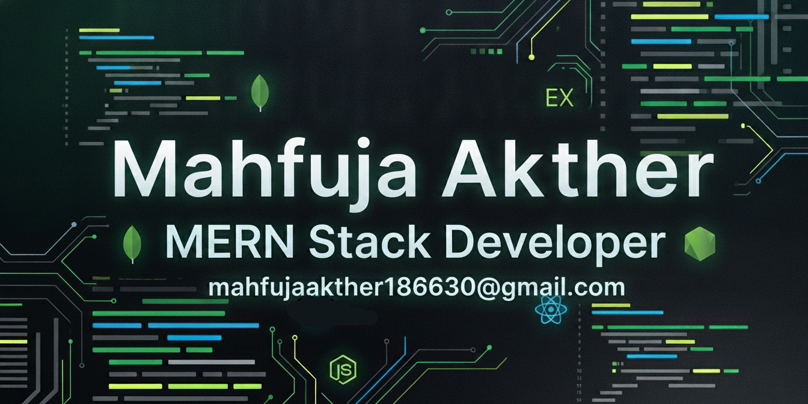

  

<!-- 

  

 -->

<!--- title --->

  <ul align="center">
    
<h1 style="display: inline-block">Hi 👋, I'm Mahfuja Akther</h1>

    <!--- typo --->
    
  </ul>

## 🌟 About Me

I am a B.Sc. in Computer Science and Engineering (CSE) student with a strong passion for **Full Stack Web Development**. I build modern, responsive, and user-friendly web applications using the **MERN stack** and continuously expand my skills through real-world projects.

Through my projects, I have implemented authentication systems, REST APIs, database management, role-based dashboards, payment integration, and responsive user interfaces. I enjoy solving real-world problems through technology and continuously improving my development and problem-solving skills.

I am seeking an opportunity to contribute to a development team, learn from experienced engineers, and grow as a Full Stack Web Developer.

 

<!-- Connect with me -->

<h3 align="left">Connect with me:</h3>

  

  

  

 

## 🛠️ Tech Stack

### 💻 Frontend

  
  
  
  
  
  
  
  

### ⚙️ Backend & Database

  
  
  
  

## 🚀 Deployment & Tools

  
  
  
  

  

  

  

---

### 🎨 Design Tools

  
  

---

## 📊 GitHub Stats

  
  

---

## 💡 Top Languages

  <!-- 
   -->
  

---

